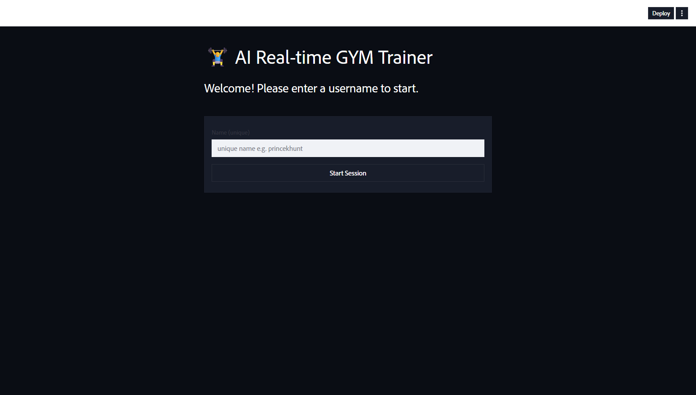
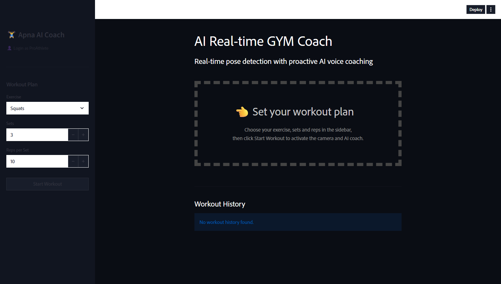
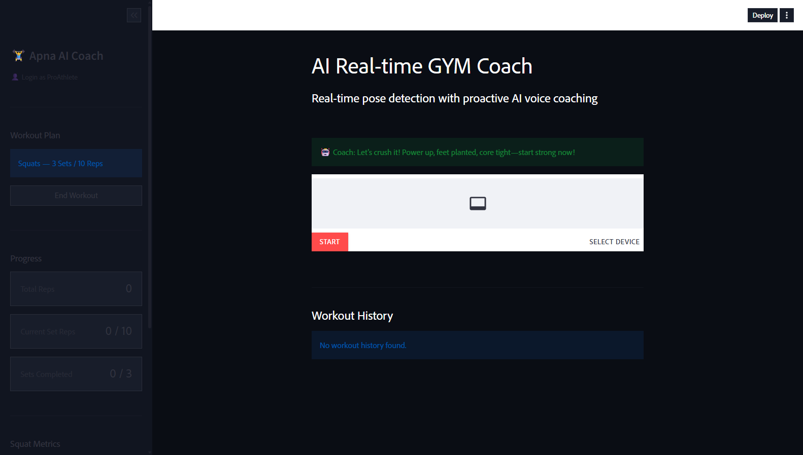
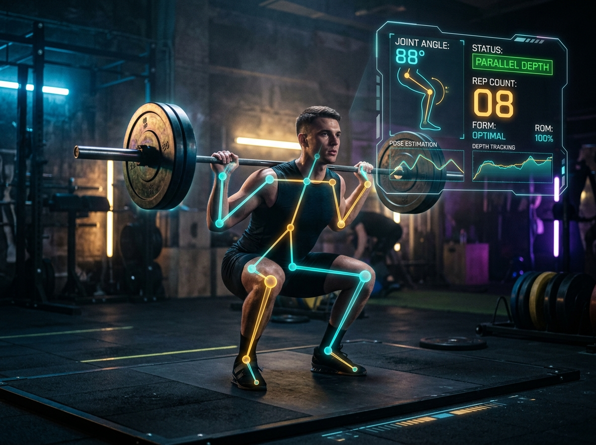
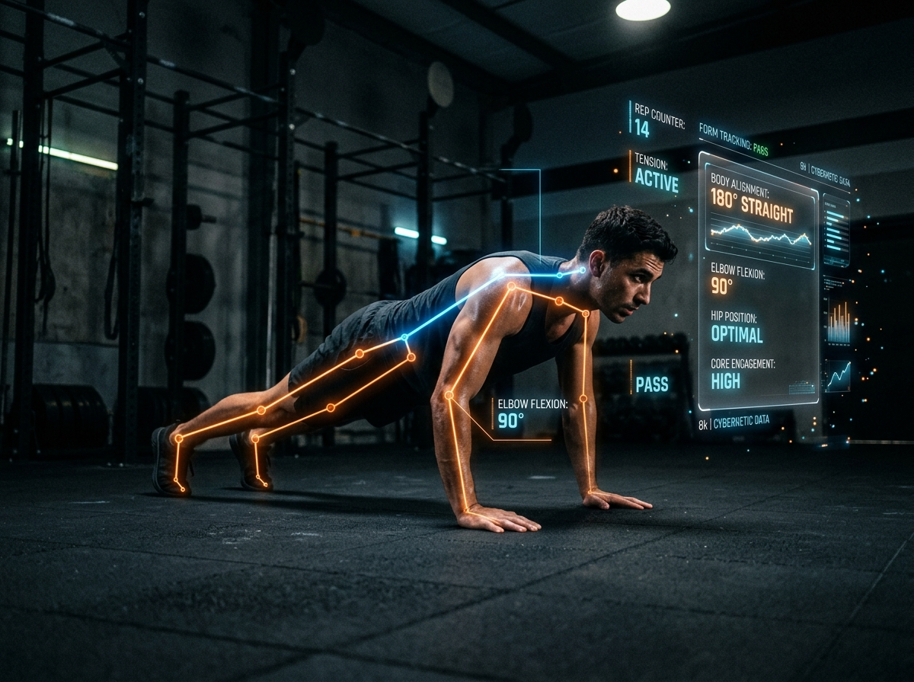
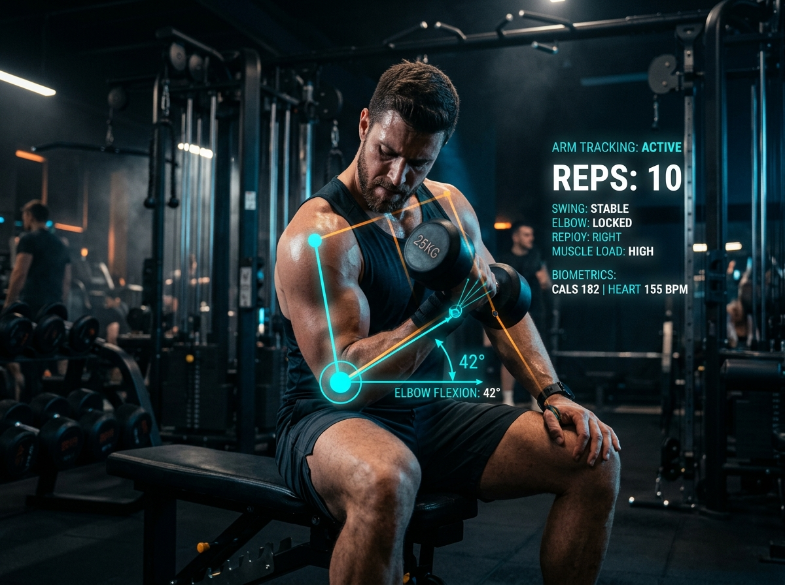

# 🏋️‍♂️ AI GYM COACH
### Real-Time Computer Vision Workout Trainer & Biomechanics Tracker

[](LICENSE)
[](https://thakurlucky9760-gif.github.io/ai-gym-coach-landing-page/)
[](https://developers.google.com/mediapipe)
[](https://opencv.org/)
[](https://smart-realtime-ai-gym-coach.streamlit.app/)
[](index.html)

**Your form. Analyzed. Corrected. In milliseconds.**  
A high-performance showcase landing page for an AI-powered fitness assistant that tracks skeletal kinematics, enforces exercise form standards, and provides real-time coaching feedback.

[**Explore Landing Page**](https://thakurlucky9760-gif.github.io/ai-gym-coach-landing-page/) • [**Launch Streamlit HUD App**](https://smart-realtime-ai-gym-coach.streamlit.app/) • [**Report Bug**](../../issues) • [**Request Feature**](../../issues)

---

## 📌 Overview

**AI Gym Coach** is an intelligent workout analysis platform designed for serious athletes and fitness enthusiasts. Powered by computer vision and deep learning pose estimation, the system tracks joint angles in real time through your webcam, detects form degradation, counts valid reps, and delivers instant audio and visual cues to prevent injury and maximize muscular hypertrophy.

This repository contains the **official showcase landing page** featuring a dark-mode cyberpunk athletic HUD, interactive video switcher, telemetry metrics, and visual architecture galleries.

---

## ✨ Key Features

- **⚡ Real-time Joint Angle & Kinematics Tracking**: Computes accurate anatomical angles across shoulders, elbows, hips, and knees using MediaPipe keypoints.
- **🎯 Precise Form & Rep Validation**:
  - **Squats**: Detects parallel depth (88° - 90° hip-knee angle) and warns against knee valgus / caving.
  - **Push-ups**: Monitors 180° linear spinal alignment and assesses full elbow flexion/extension.
  - **Biceps Curls**: Enforces elbow pin isolation and detects torso momentum drift (anti-cheat / anti-swing).
- **🎙️ Real-time Audio Cues**: Integrates low-latency voice feedback powered by Groq to deliver audible form reminders mid-rep.
- **🎮 Interactive Exercise Video Switcher**: Seamlessly toggle between live exercise demonstration feeds (Full System, Push-up, Biceps Curls) directly in the browser.
- **💎 Cyberpunk Athletic Aesthetic**: Built with custom scanlines, ambient radial glow, corner brackets, and responsive card micro-interactions.
- **📱 Zero Dependency & Zero Build Step**: 100% pure HTML5, modern CSS3 variables, and vanilla JavaScript. Runs anywhere without `npm install` or compilation.

---

## 📸 Visual Gallery

| User Authentication & Sessions | Exercise Specifications & Plan | Active Workout HUD |
| :---: | :---: | :---: |
|  |  |  |
| *Athlete login storing session state & history* | *Custom exercise sets, target reps & parameters* | *Live WebRTC feed with telemetry & rep counters* |

| Squat Kinematics | Push-up Alignment | Biceps Curl Isolation |
| :---: | :---: | :---: |
|  |  |  |
| *MediaPipe 88° parallel depth detection* | *180° spinal alignment & elbow tracking* | *Torso momentum drift & anti-swing cues* |

---

## 🛠️ Technology Stack

| Layer | Technologies |
| :--- | :--- |
| **Landing Page Frontend** | HTML5, Modern CSS3 (Variables, Grid, Flexbox, Animations), Vanilla JavaScript (ES6+) |
| **Typography** | Averta, Instrument Serif, Ubuntu |
| **Computer Vision Engine** | Google MediaPipe Pose, OpenCV (Python) |
| **Application UI & Streamer** | Streamlit, Streamlit-WebRTC |
| **Audio & AI Logic** | Groq API (Low-latency Audio & LLM Coaching) |
| **Hosting & CI/CD** | GitHub Pages, GitHub Actions Workflow |

---

## 📂 Project Structure

```bash
ai-gym-coach-landing-page/
├── .github/
│   ├── workflows/
│   │   └── deploy.yml            # Automated GitHub Pages CI/CD deployment
│   ├── ISSUE_TEMPLATE/
│   │   ├── bug_report.md         # GitHub bug report issue template
│   │   └── feature_request.md    # GitHub feature request issue template
│   └── pull_request_template.md  # Standard GitHub PR template
├── fonts/
│   └── Averta.woff2              # Custom Averta font asset
├── IMGs/                         # Production gallery and screenshot assets
│   ├── i1.png                    # Login page screenshot
│   ├── i2.png                    # Specifications screenshot
│   ├── i3.png                    # Active HUD screenshot
│   ├── i4.png                    # Squat kinematics analysis
│   ├── i5.png                    # Push-up form feedback
│   └── i6.png                    # Biceps curl isolation tracking
├── IMGs_add_your_own/            # Drop-in folder for custom athlete screenshots
├── videos/                       # Interactive exercise demo clips
│   ├── video.mp4                 # Full coach system demo
│   ├── pushup_exercise.mp4       # Push-up alignment demo
│   └── curl_exercise.mp4         # Biceps curl tracking demo
├── videos_add_your_own/          # Drop-in folder for custom exercise recordings
├── .gitattributes                # Cross-platform LF normalization & binary protection
├── .gitignore                    # Production git ignore configuration
├── CONTRIBUTING.md               # Contribution guidelines
├── CODE_OF_CONDUCT.md            # Contributor Covenant Code of Conduct
├── favicon.svg                   # High-tech glowing AI coach SVG favicon
├── index.html                    # Main semantic landing page markup
├── LICENSE                       # MIT License
├── README.md                     # Repository documentation
└── style.css                     # Design system, theme tokens & responsive styles
```

---

## 🚀 Quickstart & Local Setup

Because this landing page has **zero external package dependencies**, you can preview and run it immediately!

### Option 1: Direct File Launch
Double-click `index.html` or open it directly in any modern browser (Chrome, Edge, Firefox, Safari).

### Option 2: Local Python Server (Recommended)
Open your terminal in the repository root directory and run:

```bash
# Python 3
python -m http.server 3000
```
Then navigate to `http://localhost:3000` in your browser.

### Option 3: VS Code Live Server
If you use VS Code, install the **Live Server** extension, right-click `index.html`, and select **"Open with Live Server"**.

### Connecting to the Live Streamlit App
By default, the **"Try it live"** CTA points directly to the deployed cloud instance:
🔗 **[smart-realtime-ai-gym-coach.streamlit.app](https://smart-realtime-ai-gym-coach.streamlit.app/)**

If you prefer to run or develop the backend Streamlit AI Gym Coach locally:
1. Start your local Streamlit server:
   ```bash
   streamlit run app.py
   ```
2. Change the `href` in `index.html` to `http://localhost:8501`.

---

## 🌐 Deploying to GitHub Pages

This repository comes pre-configured with **GitHub Actions** for zero-config automated deployment:

1. **Push this repository to GitHub**:
   ```bash
   git remote add origin https://github.com/thakurlucky9760-gif/ai-gym-coach-landing-page.git
   git branch -M main
   git push -u origin main
   ```
2. In your GitHub repository:
   - Go to **Settings** > **Pages**.
   - Under **Build and deployment** > **Source**, choose **GitHub Actions**.
3. Every time you push to `main`, the included `.github/workflows/deploy.yml` workflow will automatically build and publish your site!
4. Your site will be live at:
   `https://<your-username>.github.io/<repo-name>/`

---

## 🎨 Customizing Media & Assets

Want to showcase your own workout tracking clips and UI themes?

1. **Replace Screenshots**:
   - Save your screenshots as `.png` files into `IMGs/`.
   - Update the image references or descriptions in `index.html` under `<section class="visuals">`.
2. **Replace Exercise Videos**:
   - Save your demo recordings as MP4 files into `videos/`.
   - Update the `switchVideo('videos/<your_clip>.mp4', this, '<LABEL>')` function calls in `index.html`.
3. **Change Palette & Accents**:
   - Open `style.css` and modify the root theme tokens:
     ```css
     :root {
       --amber: #f5a623;   /* Primary accent */
       --cyan:  #00d4ff;   /* Telemetry / highlight accent */
       --bg:    #0a0a0a;   /* Deep canvas background */
     }
     ```

---

## 🤝 Contributing

Contributions, feedback, and suggestions are welcome!
1. Check out our [Contributing Guidelines](CONTRIBUTING.md).
2. Fork the repository and create your branch (`git checkout -b feature/cool-idea`).
3. Commit your changes (`git commit -m "feat: add feature"`).
4. Push to your fork (`git push origin feature/cool-idea`).
5. Open a Pull Request!

---

## 👨‍💻 Author & Connect

**Chaitanya Pratap**  
Machine Learning Engineer & Computer Vision Developer

- 💼 **LinkedIn**: [Chaitanya Pratap](https://www.linkedin.com/in/chaitanya-pratap-193697368)
- 🐙 **GitHub**: [@thakurlucky9760-gif](https://github.com/thakurlucky9760-gif)
- ✉️ **Email**: [thakurlucky9760@gmail.com](mailto:thakurlucky9760@gmail.com)

---

## 📄 License

Distributed under the **MIT License**. See [`LICENSE`](LICENSE) for full details.
